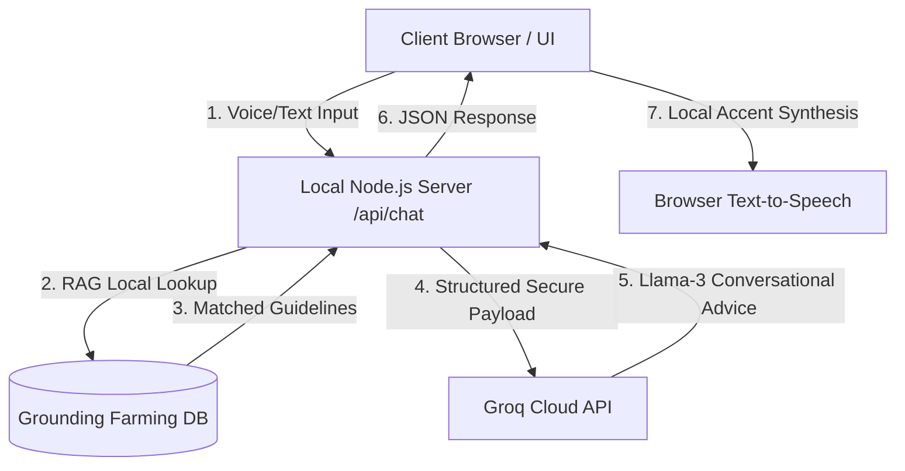

# Namrata 🌱 - Connecting Dreams

### Secure Voice-Based Multilingual Natural Farming Consultant

Namrata is a production-grade, secure conversational voice assistant designed to empower farmers, rural agriculture advisors, and sustainable farming practitioners. Built with a modern **React + Vite + Tailwind CSS v4 + TypeScript** client and a secure **Node.js** backend, it provides instant, practical, and grounded organic agricultural advice in **English, Hindi, and Tamil**.

---

## 🚀 Key Highlights

*   **Premium React Frontend**: Recreated with a modern, high-performance, single-page application structure featuring TypeScript type safety and Tailwind CSS v4 utility styling.
*   **Aesthetic Light Theme**: A beautiful, clean, white-themed chat advisor dashboard designed for high-contrast sunlight readability in the field.
*   **Secure API Architecture**: Complete isolation of the Groq API key on the backend. Client browsers communicate with the secure `/api/chat` server gateway, preventing credential theft or front-end exposure.
*   **Cinematic Video Landing Page**: A gorgeous fullscreen landing page section utilizing an overlay looping video background with custom fade-in/fade-out transitions.
*   **Custom Voice Profile Selector**: Advanced settings to choose speech-to-text and text-to-speech models installed on the user's browser, permitting localized accents (English, Hindi, and Tamil voices) cached per language.
*   **Liquid SVG Morphing Visualizer**: A breathing visualizer orb consisting of overlapping, concentric SVG paths driven by GSAP animations, reflecting state changes (Listening, Thinking, Speaking, Idle).
*   **Web Audio Sound Synthesizer**: Generates localized, lag-free musical chimes for microphone initialization and response completion utilizing native raw oscillators (no external audio assets required).

---

## 📂 Project Directory Structure

```text
Namrata/
├── dist/                # Compiled production assets served by Node/Vercel
├── frontend/            # React + Vite + TypeScript + Tailwind CSS client application
│   ├── public/          # Static public assets (favicons, SVGs)
│   ├── src/             # React application source code
│   │   ├── assets/      # Image and icon assets
│   │   ├── data/        # Multilingual database and translations (farmingData.ts)
│   │   ├── styles/      # Typography and theme configurations (fonts.css, theme.css)
│   │   ├── App.tsx      # Main application component (audio, GSAP visualizer, chat logic)
│   │   └── main.tsx     # React application entry point
│   ├── package.json     # Frontend configuration, dependencies, and build scripts
│   ├── vite.config.ts   # Vite bundler configuration (compiled output routes to root dist/)
│   └── tsconfig.json    # TypeScript compiler configuration
├── package.json         # Root package configuration containing orchestration scripts
├── server.js            # Secure Node.js server, intent parser & Groq gateway
├── .env                 # Environment variables (contains GROQ_API_KEY)
└── README.md            # Technical documentation
```

---

## ⚙️ Technical Architecture



---

## 🛠️ Installation & Execution

### 1. Requirements
- Ensure **Node.js** (version 18 or higher) and **npm** are installed on your operating system.

### 2. Configuration
Verify that the `.env` file in the root folder contains your Groq API key:
```ini
GROQ_API_KEY=gsk_your_groq_api_key_here
```

### 3. Build & Run Locally

1. Install dependencies and compile the frontend:
   ```bash
   npm run build
   ```
   *This automatically installs dependencies in the `frontend` folder and compiles the React application into the root `dist/` directory.*

2. Start the secure Node.js backend:
   ```bash
   npm start
   ```

3. Open your web browser and navigate to:
   ```text
   http://localhost:8000
   ```

---

## 💡 Features Walkthrough

### 1. Speech-to-Text (STT) Dictation & Feedback
Clicking the central visualizer orb initiates microphone capture. As you speak, a real-time transcript bubble displays your transcribing text. Clicking the orb again stops recording. The stop listening feature is fully integrated with instant button state updates.

### 2. Grounded Intent RAG Database
The backend classifies inputs into categories (Crop Diseases, Seed/Soil Advice, Subsidies/Finance, General query). If a match is found in the local verified natural farming database, it is injected as grounding instructions to the Llama-3 model, ensuring accurate, chemical-free, organic solutions.

### 3. Beautiful Professional Response Cards
Outputs are parsed into structural card blocks with distinctive color borders, heading badges, and icons:
- 🟢 **Quick Answer**: Clean summarizing text with checking marks.
- 🔵 **Step-by-Step Recipe**: Ordered lists outlining organic preparations (such as Jivamrita or Neemastra).
- 🟡 **Additional Tips**: Extra context and recommendations.
- 🔴 **Caution Note**: Crucial warnings against chemical fertilizers or pesticide misuses.

### 4. Saved Queries & Bookmarks Drawer
Open the slide-out panel on the top-right to view your saved query history or recall bookmarked advice. All data is cached locally via `localStorage`.

---

## 📜 License
This project is open-source and developed for sustainable agriculture advancement. 🌾 💚
