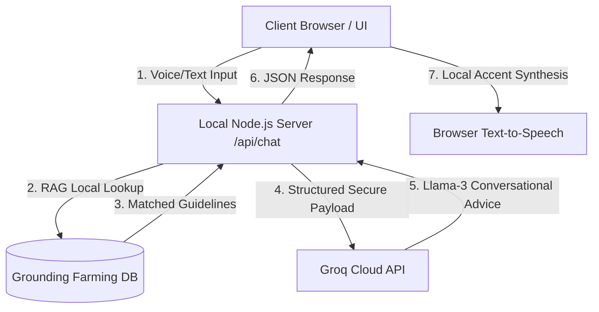

# Vriksha 🌱 - Secure Multilingual Conversational Voice Assistant for Natural Farming

Vriksha is a production-grade, secure client-server voice assistant designed to empower farmers, rural agriculture advisors, and sustainable farming practitioners. It provides instant, practical, and grounded organic agricultural advice in English, Hindi, and Tamil.

---

## 🚀 Key Highlights

*   **Zero-Dependency Node.js Server**: Built natively using Node's standard `http` and `https` libraries. Runs instantly on any machine without complex installation steps or C-bindings compile issues.
*   **Secure API Architecture**: Complete isolation of the Groq API key on the backend. Client browsers communicate with the secure `/api/chat` server gateway, preventing credential theft or front-end exposure.
*   **Custom Voice Profile Selector ("Different Voice")**: Added dynamic voice queries that fetch speech-to-text models installed on the user's browser, permitting localized accents (English, Hindi, and Tamil voices) cached per language.
*   **Liquid SVG Morphing Visualizer**: A breathing visualizer orb consisting of overlapping, concentric SVG paths driven by GSAP animations, reflecting state changes (Listening, Thinking, Speaking, Idle).
*   **Web Audio sound Synthesizer**: Generates localized, lag-free musical chimes for microphone initialization and response completion utilizing native raw oscillators (no external audio assets required).

---

## 📂 Project Directory Structure

```text
Namrata/
├── package.json         # Node.js project configuration (npm start script)
├── .env                 # Private environment variables (contains GROQ_API_KEY)
├── server.js            # Secure Node.js server, intent parser & Groq gateway
├── index.html           # Core layout structure (Material symbols, segmented tabs)
├── styles.css           # Custom Glassmorphic design system & response layouts
├── app.js               # Advanced frontend logic (Speech recognition, Web Audio synthesis, GSAP)
└── README.md            # Technical overview and deployment documentation
```

---

## ⚙️ Technical Architecture



---

## 🛠️ Installation & Execution

### 1. Requirements
- Ensure **Node.js** (version 16 or higher) is installed on your operating system.

### 2. Configuration
Verify that the `.env` file in the root folder contains your Groq API key:
```ini
GROQ_API_KEY=gsk_your_groq_api_key_here
```
*(Note: A valid API key is already pre-configured in this repository)*

### 3. Execution
Open your terminal in the project directory and start the server:
```bash
npm start
```
Or run the server file directly:
```bash
node server.js
```

### 4. Application Access
Open your web browser and navigate to:
```text
http://localhost:8000
```

---

## 💡 Features Walkthrough

### 1. Speech-to-Text (STT) Dictation
Clicking the central visualizer orb initiates the microphone capture. As you speak, a real-time transcript bubble displays your transcribing text. Clicking the orb again stops recording.

### 2. Grounded Intent RAG Database
The backend classifies inputs into categories (Crop Diseases, Seed/Soil Advice, Subsidies/Finance, General query). If a match is found in the local verified natural farming database, it is injected as grounding instructions to the Llama-3 model, ensuring accurate, chemical-free, organic solutions.

### 3. Beautiful Professional Response Cards
Outputs are parsed into structural card blocks with distinctive color borders, heading badges, and icons:
- 🟢 **Quick Answer**: Clean summarizing text with checking marks.
- 🔵 **Step-by-Step Recipe**: Ordered lists outlining organic preparations (such as Jivamrita or Neemastra).
- 🟡 **Additional Tips**: Extra context and recommendations.
- 🔴 **Caution Note**: Crucial warnings against chemical fertilizers or pesticide misuses.

### 4. Saved Queries & Bookmarks Drawer
Open the slide-out panel on the top-right to view your saved query history or recall bookmarked advice. All data is cached locally via `localStorage`.

---

## 📜 License
This project is open-source and developed for sustainable agriculture advancement. 🌾 💚
